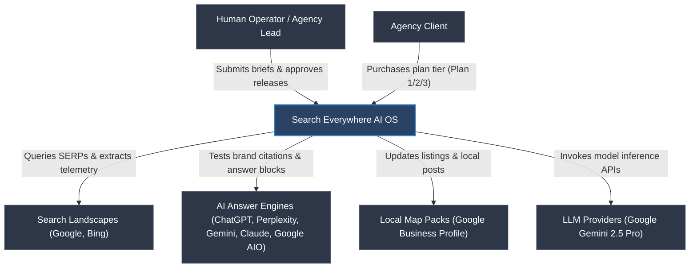
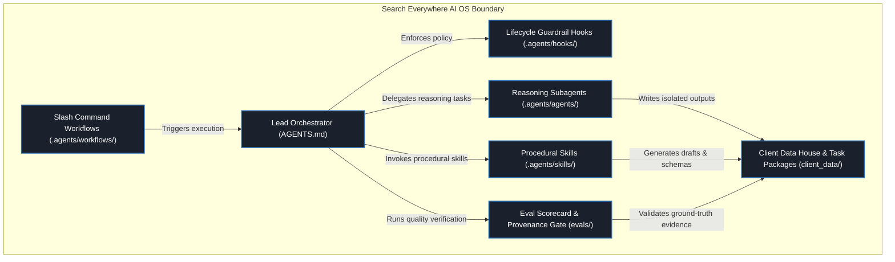
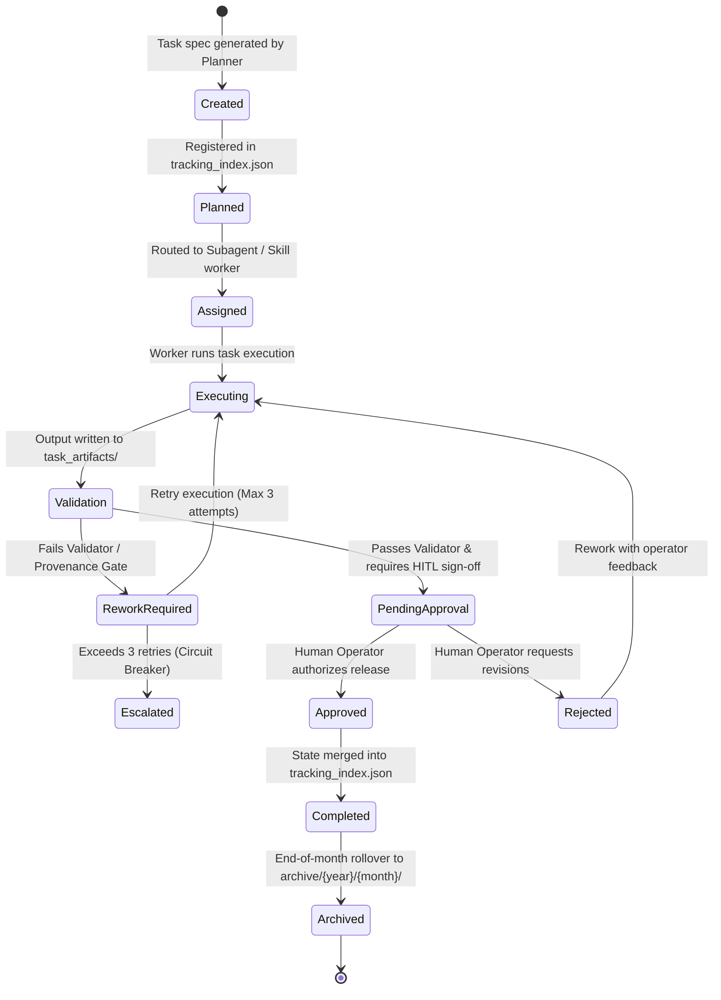

# CANONICAL ARCHITECTURE DIAGRAMS & LIFECYCLE SPECIFICATION

**Scope:** Visual System Context, Container Boundaries, and State Machine Lifecycle (Grounded in C4 Model Standards).

---

## 🖼️ 1. C4 LEVEL 1 — SYSTEM CONTEXT DIAGRAM

The System Context diagram illustrates the high-level boundary of the Search Everywhere AI Operating System, its human operators, agency clients, target search landscapes, and external LLM provider services.

---

## 📦 2. C4 LEVEL 2 — CONTAINER DIAGRAM

The Container diagram illustrates the high-level architectural building blocks inside the Search Everywhere AI OS.

---

## 🔄 3. TASK LIFECYCLE STATE MACHINE DIAGRAM

The State Machine diagram defines the strict, immutable state transitions for every task execution package (`task_spec.json` & `task_changelog.md`).

